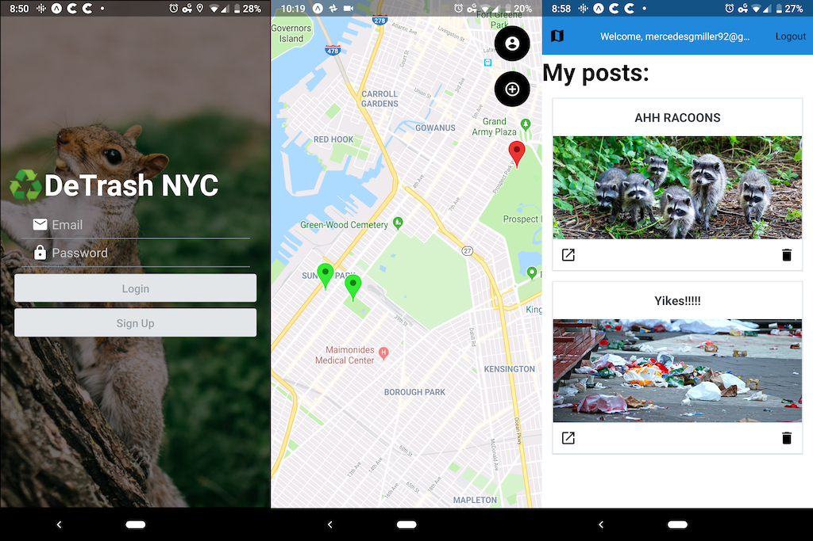

# DeTrash NYC

DeTrash NYC is a mobile application designed to allow users to alert and work with others to reduce litter in public spaces.
DeTrash NYC built with React Native and Expo. Designed for android, React Native should make it easy to refactor and run on iOS.  

This project was made for a "stackathon" in 4 days. This was my first mobile app, and was my introduction to React Native and Expo. Due to time restrictions, the code is not. great. 

In the future, I plan on returning to this and improving a lot. 

# Running

## Requirements

* Node version v12.1.0
* AWS S3 account

Some form of backend will be needed, including a database to store user data. Pictures are hosted on AWS S3. A `.env` file is needed for storing:

* Google Map API Key
* AWS3 Access Key
* AWS3 Secret Access Key 

## Setup

First clone the repository.

`git clone https://github.com/mercedesgm/stackathon`

A simple backend will need to be created before the app can be used. The files in `store/` can be viewed to see the API calls that will need to be handled. The server originally created for this contained some hardcoded values and hasn't been uploaded yet. 

anyways,

then from the root directory of the project

`expo start`

The app can then be viewed either in the android simulator, or in the expo app on an android device.

# Features

## Sign up and login

A user can create an account and use that to view and delete their past posts.

## Posting a post

A user in the app can upload a picture that will be posted to the map as a red marker. A title must be included. A use can delete their posts from their profile page. 

## Resolving a post

A user can mark their own posts or others' as resolved. In order to do so, the user must upload an "after" picture. The post's marker will change to green on the map. At this time, old posts are not removed from the map. 

## View all posts

A user can view all posts by navigating to the map page. Unresolved posts are marked red and resolved are green.

## Comments

A user can comment on their own and others' posts. Comments are updated in real-time. I did not have time to implement web sockets so I instead I used `setInterval()` ¯\\\_(ツ)\_/¯

Also, you can't see what you're typing.

